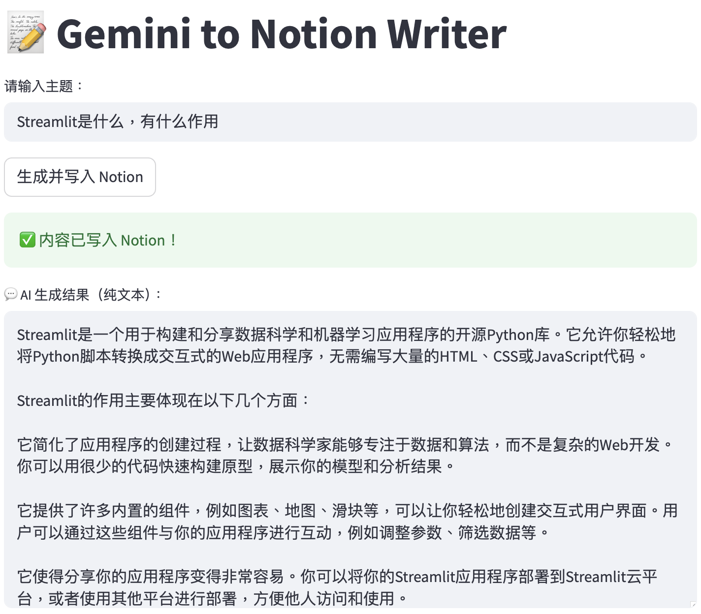
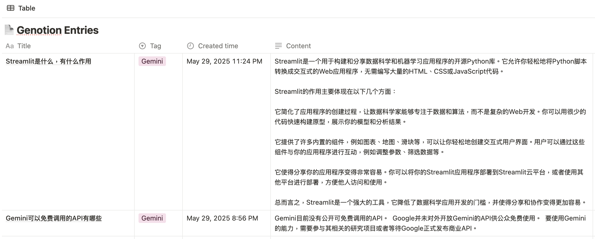

# 📝 Genotion: Gemini to Notion Writer

**Genotion** is a lightweight tool that combines Google Gemini with the Notion API. It allows you to input a topic, automatically generate content using Gemini, and write it directly into your Notion database — perfect for content creators, knowledge organizers, and automation enthusiasts.

---

## 🚀 Features

- ✅ **Gemini Content Generation**: Uses Gemini 1.5 Flash model to generate structured natural language  
- 🧠 **Notion Data Writing**: Automatically populates your Notion database — no copy-paste needed  
- 📦 **Streamlit UI**: Clean, minimal front-end interface built with Streamlit  
- 🔐 **Secure Secrets Management**: Supports `.streamlit/secrets.toml` or Streamlit Cloud's secret manager  
- ☁️ **Cloud Deployable**: Easily hosted on [Streamlit Cloud](https://streamlit.io/cloud)

---

## 🌐 Try It Online

👉 [Access the deployed version](https://gemini-to-notion.streamlit.app)

---

## 🧩 Tech Stack

- Python 3.9+
- Streamlit
- Google Generative AI (`google-generativeai`)
- Notion API (`requests`)

---

## ⚙️ Run Locally

### 1️⃣ Clone the Repository

```bash
git clone https://github.com/ColdStanley/GeNotion.git
cd GeNotion
```

### 2️⃣ Install Dependencies, 3️⃣ Configure API Keys, and 4️⃣ Launch the App

```bash
# Install dependencies
pip install -r requirements.txt

# Create a secrets file
mkdir -p .streamlit
touch .streamlit/secrets.toml

# Open secrets.toml and add the following:
# (you can use any text editor, e.g., nano, code, or open it manually)
# nano .streamlit/secrets.toml

# Paste the following content inside:
# ---------------------------------------
# GEMINI_API_KEY = "your-gemini-key"
# NOTION_API_KEY = "your-notion-key"
# DATABASE_ID = "your-notion-database-id"
# ---------------------------------------

# Launch the app
streamlit run app.py
```

---

## ☁️ Deploy to Streamlit Cloud

1. Fork or push this repo to your GitHub account  
2. Visit [Streamlit Cloud](https://streamlit.io/cloud)  
3. Click `New app`, select your repo and branch  
4. Set `app.py` as the main file  
5. Go to “Secrets” and add:

```toml
GEMINI_API_KEY = "your-gemini-key"
NOTION_API_KEY = "your-notion-key"
DATABASE_ID = "your-notion-database-id"
```

---

## 📌 Sample Screenshots

**Main interface:**  


**After content is successfully written to Notion:**  


---

## 🧭 Future Plans

- [ ] Support switching between multiple models (Gemini Pro, Claude, GPT, etc.)  
- [ ] Support dynamic Notion property selection  
- [ ] Add content templates  
- [ ] Integrate OpenAI Whisper or speech-to-text features  

---

## 📄 License

MIT © 2025 [@ColdStanley](https://github.com/ColdStanley)


# 📝 Genotion: Gemini to Notion Writer

Genotion 是一个结合 Google Gemini 与 Notion API 的轻量级工具，可让你输入一个主题，自动生成内容并一键写入指定的 Notion 数据库。适合内容创作者、知识整理者和自动化工作流爱好者使用。

---

## 🚀 功能亮点

- ✅ **Gemini 内容生成**：调用 Gemini 1.5 Flash 模型生成结构化自然语言  
- 🧠 **Notion 数据写入**：自动填充 Notion 数据库，无需复制粘贴  
- 📦 **Streamlit UI**：简洁美观的前端界面，部署简单  
- 🔐 **Secrets 配置安全**：支持 `.streamlit/secrets.toml` 或 Streamlit Cloud secrets 管理  
- ☁️ **支持云部署**：可托管在 [Streamlit Cloud](https://streamlit.io/cloud)

---

## 🌐 在线体验

👉 [点击访问已部署版本](https://gemini-to-notion.streamlit.app)

---

## 🧩 技术栈

- Python 3.9+
- Streamlit
- Google Generative AI (`google-generativeai`)
- Notion API (`requests`)

---

## ⚙️ 本地运行方式

### 1️⃣ 克隆项目

```bash
git clone https://github.com/ColdStanley/GeNotion.git
cd GeNotion
```

### 2️⃣ 安装依赖

```bash
pip install -r requirements.txt
```

### 3️⃣ 配置密钥

在 `.streamlit/secrets.toml` 中添加如下内容：

```toml
GEMINI_API_KEY = "your-gemini-key"
NOTION_API_KEY = "your-notion-key"
DATABASE_ID = "your-notion-database-id"
```

### 4️⃣ 启动项目

```bash
streamlit run app.py
```

---

## ☁️ 部署到 Streamlit Cloud

1. Fork 或 push 此仓库到你自己的 GitHub  
2. 打开 [Streamlit Cloud](https://streamlit.io/cloud)  
3. 点击 `New app`，选择仓库与分支  
4. 设置 `app.py` 为主文件路径  
5. 在 “Secrets” 页面配置：

```toml
GEMINI_API_KEY = "your-gemini-key"
NOTION_API_KEY = "your-notion-key"
DATABASE_ID = "your-notion-database-id"
```

---

## 📌 示例页面截图

**主界面：**


**生成内容成功写入 Notion 后：**


---

## 🧭 后续计划

- [ ] 支持多模型切换（Gemini Pro、Claude、GPT 等）  
- [ ] 支持选择 Notion 数据库页面属性  
- [ ] 增加输入格式模板  
- [ ] 集成 OpenAI Whisper 或语音识别功能  

---

## 📄 License

MIT © 2025 [@ColdStanley](https://github.com/ColdStanley)
